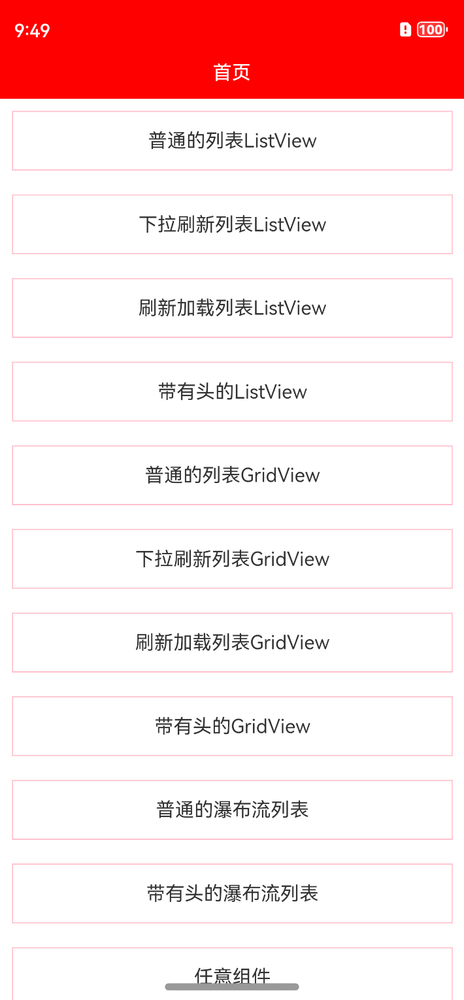

## 介绍

基于ArkUI封装的上拉下拉刷新组件，支持列表、网格、瀑布流、支持各种任意组件刷新。

**目前已经适配NEXT版本，如果您的开发环境不是NEXT版本，运行Demo可能存在问题**

截至2024年4月20日，功能点如下

- 1、**支持ListView列表/下拉刷新/上拉加载**
- 2、**支持GridView网格列表/下拉刷新/上拉加载**
- 3、**支持StaggeredGridView瀑布流列表/下拉刷新/上拉加载**
- 4、**支持自定义刷新头和加载尾**
- 5、**支持列表添加头组件**

## 效果

<p align="center">



</p>

动态效果：

<p align="center"></p>

## 开发环境

DevEco Studio NEXT Developer Beta1,Build Version: 5.0.3.100

Api版本：**11**

hvigorVersion：4.2.0

**注意，5.0.3.100这个版本，需要配置本地hvigor**

## 快速使用

有多种使用方式，比如远程依赖、本地静态共享包依赖,源码方式依赖，推荐使用**远程依赖**，方便快捷，有最新修改可以及时生效。

### 1、远程依赖方式使用【推荐】

方式一：在Terminal窗口中，执行如下命令安装三方包，DevEco Studio会自动在工程的oh-package.json5中自动添加三方包依赖。
**建议：在使用的模块路径下进行执行命令。**

```
ohpm install @abner/refresh
```

方式二：在工程的oh-package.json5中设置三方包依赖，配置示例如下：

```
"dependencies": { "@abner/refresh": "^1.0.2"}
```

<p align="center"></p>

### 2、本地静态共享包har包使用

<p>首先，下载har包，<a href="https://vipandroid-image.oss-cn-beijing.aliyuncs.com/harmony/refresh/refresh-1.0.2.har">点击下载</a></p>
<p>下载之后，把har包复制项目中，目录自己创建，如下，我创建了一个libs目录，复制进去</p>
<p></p>
<p>引入之后，进行同步项目，点击Sync Now即可，当然了你也可以，将鼠标放置在报错处会出现提示，在提示框中点击Run 'ohpm install'。</p>
<p>需要注意，<strong>@abner/refresh</strong>，是用来区分目录的，可以自己定义，比如@aa/bb等，关于静态共享包的创建和使用，请查看如下我的介绍，这里就不过多介绍</p>

[HarmonyOS开发：走进静态共享包的依赖与使用](https://juejin.cn/post/7274982412245876776)

### 查看是否引用成功

无论使用哪种方式进行依赖，最终都会在使用的模块中，生成一个oh_modules文件，并创建源代码文件，有则成功，无则失败，如下：

<p align="center"></p>

## 代码使用

目前提供了多种种用法，一种是ListView形式，就是单列表形式，一种是GridView形式，也就是网格列表形式，一种是StaggeredGridView形式，也就是
瀑布流形式，还有一种就是RefreshLayout形式，支持任何的组件形式，比如Column，Row等等。

需要注意，目前ListView、GridView、StaggeredGridView是自带刷新的，当然了您也可以当作普通的列表进行使用。
还有一点需要注意，目前默认情况下是懒加载数据模式。

### ListView

```typescript
@State controller: RefreshController = new RefreshController() //刷新控制器，声明全局变量

ListView({
  items: this.array, //数据源 数组
  itemLayout: (item, index) => this.itemLayout(item, index), //条目布局
  controller: this.controller, //控制器，负责关闭下拉和上拉
  onRefresh: () => {
    //下拉刷新
    this.controller.finishRefresh() //关闭下拉刷新
  },
  onLoadMore: () => {
    //上拉加载
    this.controller.finishLoadMore() //关闭上拉加载
  }
})
```

#### 相关属性介绍

| 属性                      | 类型                                          | 概述                |
|-------------------------|---------------------------------------------|-------------------|
| items                   | Array\<Object\>                             | 数据源               |
| itemLayout              | @BuilderParam (item: Object, index: number) | 传递的布局             |
| controller              | RefreshController                           | 控制器，关闭下拉和上拉       |
| onRefresh               | 回调                                          | 刷新回调              |
| onLoadMore              | 回调                                          | 上拉加载              |
| listAttribute           | ListAttr                                    | ListView的相关属性     |
| listItemAttribute       | ListItemAttr                                | ListView的Item相关属性 |
| isLazyData              | boolean                                     | 是否使用懒加载，默认是懒加载    |
| lazyCachedCount         | number                                      | 懒加载缓存数据量，默认为1     |
| onLazyDataSource        | 回调                                          | 懒加载数据回调           |
| itemHeaderLayout        | @BuilderParam                               | 传递的头组件            |
| headerRefreshLayout     | @BuilderParam                               | 自定义刷新头组件          |
| footerLoadLayout        | @BuilderParam                               | 自定义加载尾组件          |
| refreshHeaderAttribute  | (attribute: RefreshHeaderAttr)              | 默认的刷新头属性          |
| loadMoreFooterAttribute | (attribute: LoadMoreFooterAttr)             | 默认的加载尾属性          |

##### ListAttr

| 属性              | 类型            | 概述                                |
|-----------------|---------------|-----------------------------------|
| width           | Length        | 宽度                                |
| height          | Length        | 高度                                |
| backgroundColor | ResourceColor | 背景颜色，默认透明                         |
| listDirection   | Axis          | 设置List组件排列方向。默认值：Axis.Vertical    |
| divider         | 对象            | 设置ListItem分割线样式，默认无分割线。           |
| scrollBar       | BarState      | 设置滚动条状态                           |
| cachedCount     | number        | 设置列表中ListItem/ListItemGroup的预加载数量 |
| edgeEffect      | EdgeEffect    | 设置组件的滑动效果                         |

##### ListItemAttr

| 属性              | 类型            | 概述        |
|-----------------|---------------|-----------|
| width           | Length        | 宽度        |
| height          | Length        | 高度        |
| backgroundColor | ResourceColor | 背景颜色，默认透明 |
| onClick         | 回调方法          | 点击事件      |

##### RefreshHeaderAttr

| 属性             | 类型                         | 概述              |
|----------------|----------------------------|-----------------|
| width          | Length                     | 刷新控件的宽度         |
| height         | Length                     | 刷新头的高度 默认高度 80  |
| timeFormat     | RefreshHeaderTimeFormat    | 刷新头的时间格式,默认月日时分 |
| timeLabel      | RefreshHeaderTimeLabel     | 刷新头的标签格式        |
| hideTime       | boolean                    | 是否隐藏刷新头时间，默认展示  |
| fontSize       | number / string / Resource | 刷新头的文字大小        |
| fontColor      | ResourceColor              | 刷新头的文字颜色        |
| timeFontSize   | number / string / Resource | 刷新头的时间文字大小      |
| timeFontColor  | ResourceColor              | 刷新头的时间文字颜色      |
| marginIconLeft | Length                     | 刷新文字距离左边的距离     |

##### LoadMoreFooterAttr

| 属性     | 类型     | 概述    |
|--------|--------|-------|
| width  | Length | 控件的宽度 |
| height | Length | 高度    |

##### RefreshHeaderTimeFormat

```text
  YMDHMS, //年月日时分秒 2024-04-08 08:08:08
  MDHMS, //月日时分秒 04-08 08:08:08
  MDHM, //月日时分秒 04-08 08:08
  HMS //时分秒 08:08:08
```

##### RefreshHeaderTimeLabel

```text
  BACKSLASH, //反斜杠 / 2024/04/08 08:08:08
  SHORTLINE, //短线 -  2024-04-08 08:08:08
  CHARACTERS //文字 年月日 2024年04月08日 08时08分08秒
```

### GridView

```typescript

@State controller: RefreshController = new RefreshController() //刷新控制器，声明全局变量

GridView({
  items: this.array, //数据源 数组
  itemLayout: (item, index) => this.itemLayout(item, index), //条目布局
  controller: this.controller, //控制器，负责关闭下拉和上拉
  onRefresh: () => {
    //下拉刷新
    this.controller.finishRefresh() //关闭下拉刷新
  },
  onLoadMore: () => {
    //上拉加载
    this.controller.finishLoadMore() //关闭上拉加载
  }
})
```

#### 相关属性介绍

| 属性                      | 类型                                          | 概述                |
|-------------------------|---------------------------------------------|-------------------|
| items                   | Array\<Object\>                             | 数据源               |
| itemLayout              | @BuilderParam (item: Object, index: number) | 传递的布局             |
| controller              | RefreshController                           | 控制器，关闭下拉和上拉       |
| onRefresh               | 回调                                          | 刷新回调              |
| onLoadMore              | 回调                                          | 上拉加载              |
| gridAttribute           | GridAttr                                    | GridView相关属性      |
| gridItemAttribute       | GridItemAttr                                | GridView的Item相关属性 |
| isLazyData              | boolean                                     | 是否使用懒加载，默认是懒加载    |
| lazyCachedCount         | number                                      | 懒加载缓存数据量，默认为1     |
| onLazyDataSource        | 回调                                          | 懒加载数据回调           |
| itemHeaderLayout        | @BuilderParam                               | 传递的头组件            |
| headerRefreshLayout     | @BuilderParam                               | 自定义刷新头组件          |
| footerLoadLayout        | @BuilderParam                               | 自定义加载尾组件          |
| refreshHeaderAttribute  | (attribute: RefreshHeaderAttr)              | 默认的刷新头属性          |
| loadMoreFooterAttribute | (attribute: LoadMoreFooterAttr)             | 默认的加载尾属性          |

##### GridAttr

| 属性              | 类型                      | 概述                                  |
|-----------------|-------------------------|-------------------------------------|
| width           | Length                  | 宽度                                  |
| height          | Length                  | 高度                                  |
| backgroundColor | ResourceColor           | 背景颜色，默认透明                           |
| columnsTemplate | string                  | 设置当前网格布局列的数量，不设置时默认2列               |
| rowsTemplate    | string                  | 设置当前网格布局行的数量，不设置时默认1行。              |
| columnsGap      | Length                  | 设置列与列的间距。默认值：0                      |
| rowsGap         | Length                  | 设置行与行的间距。默认值：0                      |
| scrollBar       | BarState                | 设置滚动条状态。默认值：BarState.Off            |
| scrollBarColor  | string / number / Color | 设置滚动条的颜色。                           |
| scrollBarWidth  | string / number /       | 设置滚动条的宽度。                           |
| cachedCount     | number                  | 设置预加载的GridItem的数量，只在LazyForEach中生效。 |

##### GridItemAttr

| 属性              | 类型               | 概述        |
|-----------------|------------------|-----------|
| width           | Length           | 宽度        |
| height          | Length           | 高度        |
| margin          | Margin / Length  | 边距        |
| padding         | Padding / Length | 内边距       |
| backgroundColor | ResourceColor    | 背景颜色，默认透明 |
| onClick         | 回调方法             | 点击事件      |

##### RefreshHeaderAttr

| 属性             | 类型                         | 概述              |
|----------------|----------------------------|-----------------|
| width          | Length                     | 刷新控件的宽度         |
| height         | Length                     | 刷新头的高度 默认高度 80  |
| timeFormat     | RefreshHeaderTimeFormat    | 刷新头的时间格式,默认月日时分 |
| timeLabel      | RefreshHeaderTimeLabel     | 刷新头的标签格式        |
| hideTime       | boolean                    | 是否隐藏刷新头时间，默认展示  |
| fontSize       | number / string / Resource | 刷新头的文字大小        |
| fontColor      | ResourceColor              | 刷新头的文字颜色        |
| timeFontSize   | number / string / Resource | 刷新头的时间文字大小      |
| timeFontColor  | ResourceColor              | 刷新头的时间文字颜色      |
| marginIconLeft | Length                     | 刷新文字距离左边的距离     |

##### LoadMoreFooterAttr

| 属性     | 类型     | 概述    |
|--------|--------|-------|
| width  | Length | 控件的宽度 |
| height | Length | 高度    |

##### RefreshHeaderTimeFormat

```text
  YMDHMS, //年月日时分秒 2024-04-08 08:08:08
  MDHMS, //月日时分秒 04-08 08:08:08
  MDHM, //月日时分秒 04-08 08:08
  HMS //时分秒 08:08:08
```

##### RefreshHeaderTimeLabel

```text
  BACKSLASH, //反斜杠 / 2024/04/08 08:08:08
  SHORTLINE, //短线 -  2024-04-08 08:08:08
  CHARACTERS //文字 年月日 2024年04月08日 08时08分08秒
```

### StaggeredGridView

```typescript

@State controller: RefreshController = new RefreshController() //刷新控制器，声明全局变量

StaggeredGridView({
  items: this.array, //数据源
  itemLayout: (item: Object, index: number) => this.itemLayout(item, index), //条目布局
  controller: this.controller, //控制器，负责关闭下拉和上拉
  onRefresh: () => {
    //下拉刷新
    this.controller.finishRefresh()
  },
  onLoadMore: () => {
    //上拉加载
    this.controller.finishLoadMore()
  }
})
```

#### 相关属性介绍

| 属性                      | 类型                                          | 概述             |
|-------------------------|---------------------------------------------|----------------|
| columnsTemplate         | string                                      | 展示几列，默认是两列     |
| columnsGap              | Length                                      | 列与列的间距，默认为0    |
| rowsGap                 | Length                                      | 行与行的间距         |
| bgColor                 | ResourceColor                               | 整体的背景          |
| sWidth                  | Length                                      | 宽度             |
| sHeight                 | Length                                      | 高度             |
| items                   | Array\<Object\>                             | 数据源            |
| itemLayout              | @BuilderParam (item: Object, index: number) | 传递的布局          |
| controller              | RefreshController                           | 控制器，关闭下拉和上拉    |
| onRefresh               | 回调                                          | 刷新回调           |
| onLoadMore              | 回调                                          | 上拉加载           |
| isLazyData              | boolean                                     | 是否使用懒加载，默认是懒加载 |
| lazyCachedCount         | number                                      | 懒加载缓存数据量，默认为1  |
| onLazyDataSource        | 回调                                          | 懒加载数据回调        |
| itemHeaderLayout        | @BuilderParam                               | 传递的头组件         |
| headerRefreshLayout     | @BuilderParam                               | 自定义刷新头组件       |
| footerLoadLayout        | @BuilderParam                               | 自定义加载尾组件       |
| refreshHeaderAttribute  | (attribute: RefreshHeaderAttr)              | 默认的刷新头属性       |
| loadMoreFooterAttribute | (attribute: LoadMoreFooterAttr)             | 默认的加载尾属性       |

##### RefreshHeaderAttr

| 属性             | 类型                         | 概述              |
|----------------|----------------------------|-----------------|
| width          | Length                     | 刷新控件的宽度         |
| height         | Length                     | 刷新头的高度 默认高度 80  |
| timeFormat     | RefreshHeaderTimeFormat    | 刷新头的时间格式,默认月日时分 |
| timeLabel      | RefreshHeaderTimeLabel     | 刷新头的标签格式        |
| hideTime       | boolean                    | 是否隐藏刷新头时间，默认展示  |
| fontSize       | number / string / Resource | 刷新头的文字大小        |
| fontColor      | ResourceColor              | 刷新头的文字颜色        |
| timeFontSize   | number / string / Resource | 刷新头的时间文字大小      |
| timeFontColor  | ResourceColor              | 刷新头的时间文字颜色      |
| marginIconLeft | Length                     | 刷新文字距离左边的距离     |

##### LoadMoreFooterAttr

| 属性     | 类型     | 概述    |
|--------|--------|-------|
| width  | Length | 控件的宽度 |
| height | Length | 高度    |

##### RefreshHeaderTimeFormat

```text
  YMDHMS, //年月日时分秒 2024-04-08 08:08:08
  MDHMS, //月日时分秒 04-08 08:08:08
  MDHM, //月日时分秒 04-08 08:08
  HMS //时分秒 08:08:08
```

##### RefreshHeaderTimeLabel

```text
  BACKSLASH, //反斜杠 / 2024/04/08 08:08:08
  SHORTLINE, //短线 -  2024-04-08 08:08:08
  CHARACTERS //文字 年月日 2024年04月08日 08时08分08秒
```

#### RefreshLayout

```typescript
RefreshLayout({
  controller: this.controller,
  itemLayout: () => this.itemLayout(), //条目布局
  onRefresh: () => {
    this.controller.finishRefresh()
  },
  onLoadMore: () => {
    this.controller.finishLoadMore()
  }
}
)
```


#### 更多案例

可以查看相关Demo。

运行Demo，如果自身相关开发环境不一致，会运行失败，可更改环境或者直接源码复制至您的项目即可。

#### 常见问题

如果你打算下载源码使用，并且你的开发环境比较低，会造成，运行工程失败问题，常见错误如下，是因为开发环境不一致造成。

<p align="center"></p>

**您可以选择解决问题，解决方式如下：**

[解决DevEco Studio低版本导入高版本项目运行失败问题](https://juejin.cn/post/7280746811328692258)

您也可以不运行，直接进行使用，完全没有问题。

## 关注公众号

鸿蒙先驱者，只分享精华的鸿蒙或者移动端技术文章，可扫码关注

<p></p>

[鸿蒙精华技术文章列表](https://juejin.cn/column/7269566781248389178)

## 一对一指导【收费】

每个人的时间都是宝贵的，做为开发者的我，已经做到了技术上的免费开源，但仍然有很多问题无法做到及时处理。 
也考虑到，鸿蒙是一个新的系统，大家在使用上会遇到各种各样的问题，也为了能够及时的解决及回复问题，大家可以付费进行一对一指导。

<p></p>

**重要信息：一定要在备注您的微信号，我会主动加您！切记！切记！！切记！！！**

**一杯饮料的钱，您可以获取权益如下**

- 1、针对刷新库使用1对1辅导使用，并跟踪相关问题排查。
- 2、针对我的所有鸿蒙开源库，1对1辅导使用，并跟踪相关问题排查。
- 3、根据时间安排，您的任何鸿蒙项目所遇到的问题，进行协助排查解决。
- 4、未来鸿蒙开源库，先遣体验。
- 5、未来鸿蒙脚手架，首批次体验使用。

<p>可以通过文字、语音、视频、远程辅助，让您的鸿蒙道路更加顺畅！</p>

### License

```
Copyright (C) AbnerMing, HarmonyOsRefresh Open Source Project

Licensed under the Apache License, Version 2.0 (the "License");
you may not use this file except in compliance with the License.
You may obtain a copy of the License at

     http://www.apache.org/licenses/LICENSE-2.0

Unless required by applicable law or agreed to in writing, software
distributed under the License is distributed on an "AS IS" BASIS,
WITHOUT WARRANTIES OR CONDITIONS OF ANY KIND, either express or implied.
See the License for the specific language governing permissions and
limitations under the License.
```
