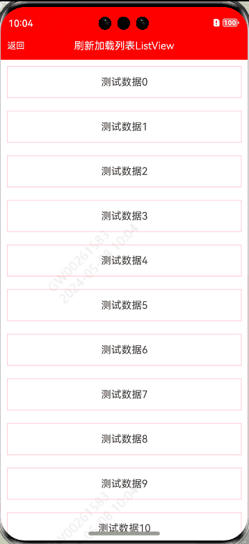
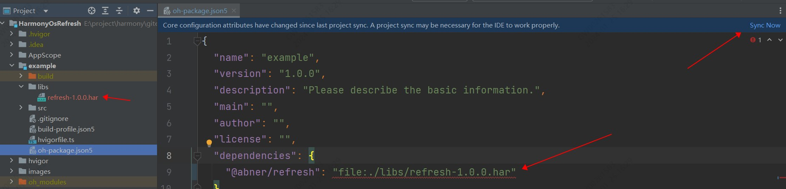
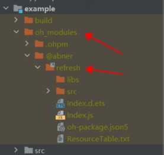

# HarmonyOsRefresh

HarmonyOsRefresh是一个鸿蒙版的刷新组件，超简单使用，支持下拉刷新和上拉加载，支持各种组件，List、Grid、Column、Row……

### 效果

<p align="center"></p>

### 开发环境

DevEco Studio 4.0 Beta2,Build Version: 4.0.0.400

Api版本：9

hvigorVersion：3.0.2

#### 常见问题

如果你的开发环境比较低，会造成，下载源码，运行工程失败问题，常见错误如下，是因为开发环境不一致造成。

<p align="center"></p>

**您可以选择解决问题，解决方式如下：**

[解决DevEco Studio低版本导入高版本项目运行失败问题](https://juejin.cn/post/7280746811328692258)

您也可以不运行，直接进行使用，完全没有问题。

### 快速使用

**私服和远程依赖**，由于权限和审核问题，预计需要等到2024年第一季度面向所有开发者，所以，只能使用**本地静态共享包**和**源码**
两种使用方式，本地静态共享包类似Android中的aar依赖，直接复制到项目中即可。

#### 本地静态共享包har包使用

<p>首先，下载har包，<a href="https://github.com/AbnerMing888/HarmonyOsRefresh/raw/master/entry/libs/refresh-1.0.0.har">点击下载</a></p>
<p>下载之后，把har包复制项目中，目录自己创建，如下，我创建了一个libs目录，复制进去</p>
<p></p>
<p>引入之后，进行同步项目，点击Sync Now即可，当然了你也可以，将鼠标放置在报错处会出现提示，在提示框中点击Run 'ohpm install'。</p>
<p>需要注意，<strong>@app/refresh</strong>，是用来区分目录的，可以自己定义，比如@aa/bb等，关于静态共享包的创建和使用，请查看如下我的介绍，这里就不过多介绍</p>

[HarmonyOS开发：走进静态共享包的依赖与使用](https://juejin.cn/post/7274982412245876776)

#### 查看是否引用成功

无论使用哪种方式进行依赖，最终都会在使用的模块中，生成一个oh_modules文件，并创建源代码文件，有则成功，无则失败，如下：

<p align="center"></p>

### 代码使用

目前提供了三种用法，一种是ListView形式，就是单列表形式，一种是GridView形式，也就是网格列表形式，还有一种就是RefreshLayout形式，支持任何的组件形式，比如Column，Row等等。

#### ListView

```typescript
ListView({
  items: this.array, //数据源 数组
  itemLayout: (item, index) => this.itemLayout(item, index), //条目布局
  controller: this.controller, //控制器，负责关闭下拉和上拉
  onRefresh: () => {
    //下拉刷新
    this.controller.finishRefresh()
  },
  onLoadMore: () => {
    //上拉加载
    this.controller.finishLoadMore()
  }
})
```

#### 相关属性介绍

| 属性                | 类型           | 概述                    |
|-------------------|--------------|-----------------------|
| listAttribute     | ListAttr     | ListView的相关属性         |
| listItemAttribute | ListItemAttr | ListView的Item相关属性     |
| marginHeader      | number       | 距离头部多少距离，用于顶部有固定组件时使用 |


##### ListAttr

| 属性              | 类型            | 概述                                |
|-----------------|---------------|-----------------------------------|
| width           | Length        | 宽度                                |
| height          | Length        | 高度                                |
| backgroundColor | ResourceColor | 背景颜色，默认透明                         |
| listDirection   | Axis          | 设置List组件排列方向。默认值：Axis.Vertical    |
| divider         | 对象            | 设置ListItem分割线样式，默认无分割线。           |
| scrollBar       | BarState      | 设置滚动条状态                           |
| cachedCount     | number        | 设置列表中ListItem/ListItemGroup的预加载数量 |
| edgeEffect      | EdgeEffect    | 设置组件的滑动效果                         |

##### ListItemAttr

| 属性              | 类型            | 概述        |
|-----------------|---------------|-----------|
| width           | Length        | 宽度        |
| height          | Length        | 高度        |
| backgroundColor | ResourceColor | 背景颜色，默认透明 |
| onClick         | 回调方法          | 点击事件      |

#### GridView

```typescript
GridView({
  items: this.array, //数据源 数组
  itemLayout: (item, index) => this.itemLayout(item, index), //条目布局
  controller: this.controller, //控制器，负责关闭下拉和上拉
  onRefresh: () => {
    //下拉刷新
    this.controller.finishRefresh() //关闭下拉刷新
  },
  onLoadMore: () => {
    //上拉加载
    this.controller.finishLoadMore() //关闭上拉加载
  }
})
```

#### 相关属性介绍

| 属性                | 类型           | 概述                    |
|-------------------|--------------|-----------------------|
| gridAttribute     | GridAttr     | GridView相关属性          |
| gridItemAttribute | GridItemAttr | GridView的Item相关属性     |
| marginHeader      | number       | 距离头部多少距离，用于顶部有固定组件时使用 |

##### GridAttr

| 属性              | 类型                      | 概述                                  |
|-----------------|-------------------------|-------------------------------------|
| width           | Length                  | 宽度                                  |
| height          | Length                  | 高度                                  |
| backgroundColor | ResourceColor           | 背景颜色，默认透明                           |
| columnsTemplate | string                  | 设置当前网格布局列的数量，不设置时默认2列               |
| rowsTemplate    | string                  | 设置当前网格布局行的数量，不设置时默认1行。              |
| columnsGap      | Length                  | 设置列与列的间距。默认值：0                      |
| rowsGap         | Length                  | 设置行与行的间距。默认值：0                      |
| scrollBar       | BarState                | 设置滚动条状态。默认值：BarState.Off            |
| scrollBarColor  | string / number / Color | 设置滚动条的颜色。                           |
| scrollBarWidth  | string / number /       | 设置滚动条的宽度。                           |
| cachedCount     | number                  | 设置预加载的GridItem的数量，只在LazyForEach中生效。 |

##### GridItemAttr

| 属性              | 类型               | 概述        |
|-----------------|------------------|-----------|
| width           | Length           | 宽度        |
| height          | Length           | 高度        |
| margin          | Margin / Length  | 边距        |
| padding         | Padding / Length | 内边距       |
| backgroundColor | ResourceColor    | 背景颜色，默认透明 |
| onClick         | 回调方法             | 点击事件      |

#### RefreshLayout

```typescript
RefreshLayout({
        controller: this.controller, //控制器，负责关闭下拉和上拉
        onRefresh: () => {
          //下拉刷新
          this.controller.finishRefresh() //关闭下拉刷新
        }, onLoadMore: () => {
  //上拉加载
  this.controller.finishLoadMore() //关闭上拉加载
} }) {
        //可以是任何组件 List/Grid/Column/Row/Text/……

        List() {
          ForEach(this.array, (item, index) => {
            ListItem() {
              Text("测试数据" + index)
                .width("95%")
                .height(50)
                .margin(10)
                .textAlign(TextAlign.Center)
                .border({ width: 1, color: Color.Pink })
            }
          }, item => item)
        }
.width("100%")
  .height("100%")
  .onScrollIndex((start: number, end: number) => {
    //必须添加，用于控制下拉和上拉何时展示
    this.controller.markLocation(start, end, this.array.length - 1)
  })
  .edgeEffect(EdgeEffect.None)

}
```

#### 头部固定组件方式

```typescript
Stack() {
      ListView({
        items: this.array, //数据源 数组
        itemLayout: (item, index) => this.itemLayout(item, index),
        controller: this.controller, //控制器，负责关闭下拉和上拉
        marginHeader: 80,
        onRefresh: () => {
          //下拉刷新
          this.controller.finishRefresh()
        },
        onLoadMore: () => {
          //上拉加载
          this.controller.finishLoadMore()
        }
      })


      Row() {
        Text("我是标题")
      }.width("100%")
  .height(80)
  .justifyContent(FlexAlign.Center)
  .backgroundColor(Color.Pink)

}.alignContent(Alignment.Top)
```

### 欢迎关注作者

微信搜索【App开发干货铺】，或扫描下面二维码关注，查阅更多技术文章！


### 赞赏作者

看在作者这么努力的份上，微信赞赏随意，给个鼓励好不好~


### License

```
Copyright (C) AbnerMing, HarmonyOsRefresh Open Source Project

Licensed under the Apache License, Version 2.0 (the "License");
you may not use this file except in compliance with the License.
You may obtain a copy of the License at

     http://www.apache.org/licenses/LICENSE-2.0

Unless required by applicable law or agreed to in writing, software
distributed under the License is distributed on an "AS IS" BASIS,
WITHOUT WARRANTIES OR CONDITIONS OF ANY KIND, either express or implied.
See the License for the specific language governing permissions and
limitations under the License.
```
